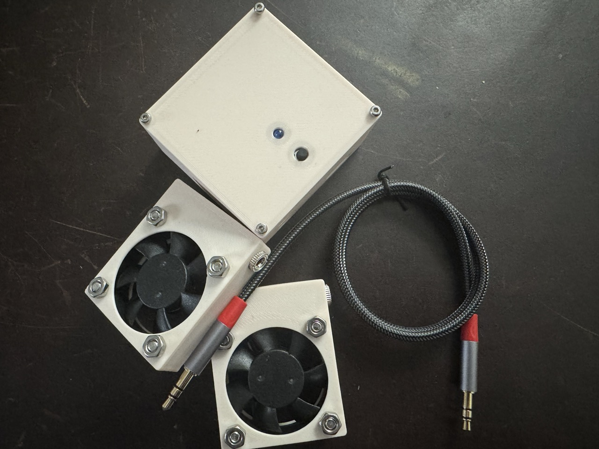

# attiny85 skate dryer/boot fan

Toy project to make a little boot dryer to dry my skates between games in the
[TT draft tournament](https://www.teamtranshockey.com/tournament-home/) and to
play with the
[attiny85](https://ww1.microchip.com/downloads/en/devicedoc/atmel-2586-avr-8-bit-microcontroller-attiny25-attiny45-attiny85_datasheet.pdf).

From `main.c`:
 
> Simple one-button skate/boot dryer using attiny85. Button press wakes mcu and
> enters input mode. During input mode, zero presses = fan off, one press = run
> for short duration, two = med, three = long. After input mode timeout, fan
> runs for specified period then mcu sleeps.
> 
> button is simple tacticle with hacky software debounce on pin 2. fan
> controlled by transistor on pin 1. ui led on pin 0.
> 
> CPU is prescaled low and timers/counters used for UI/fan timeouts.
